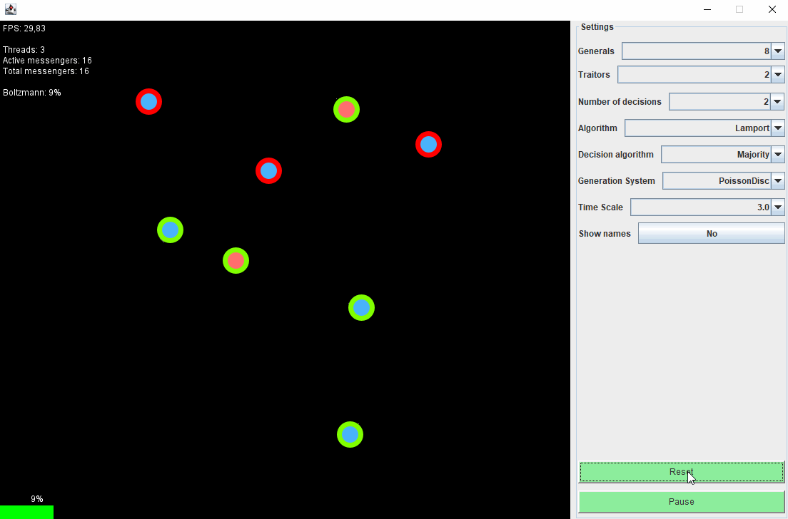
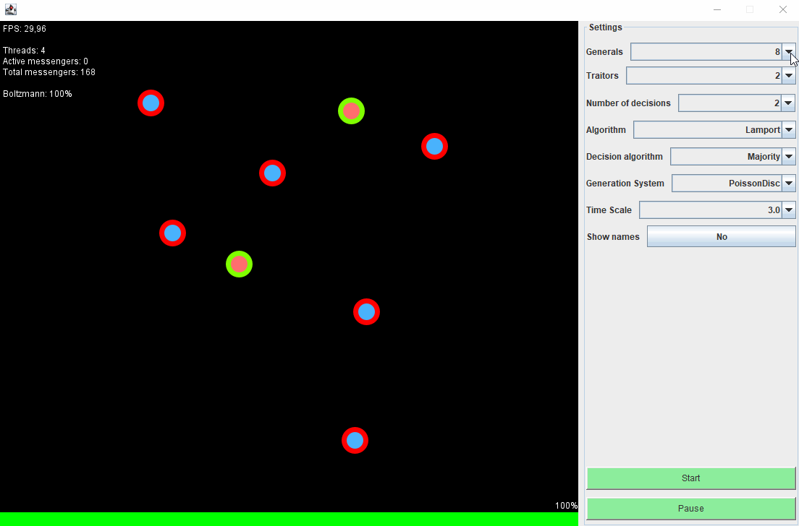

# Byzantine Generals Problem

This application has been created as a project for Software engineering course ANS Tarnów 2021/2022

## Features list:
* Visualisation of generals sending messages between each other
* Four algorithms (Lamport, King, Voter, q-Voter)
* Simple implementation of blockchain technology to verify and store messages

## Images

## How to run
Simply run ByzantineMain.java file from /src folder